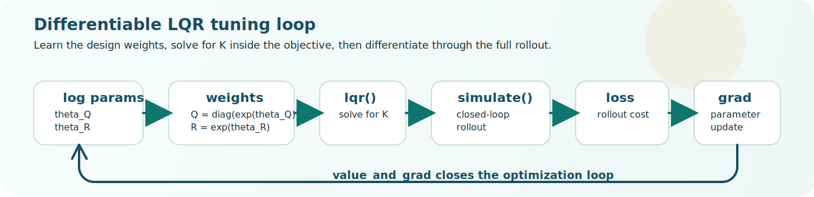

# Contrax

**Differentiable control theory primitives for JAX.**

[](https://github.com/givani30/Contrax/actions/workflows/ci.yml)
[](https://givani30.github.io/Contrax/)
[](https://pypi.org/project/contrax/)
[](https://pypi.org/project/contrax/)
[](LICENSE)

Contrax is a JAX-native systems, estimation, and control toolbox.
MATLAB-familiar names at the API surface — `ss`, `lqr`, `kalman`, `place` —
with `jit`, `vmap`, and `grad` behavior underneath.

**[Documentation](https://givani30.github.io/Contrax/)** · [Getting started](https://givani30.github.io/Contrax/getting-started/) · [API reference](https://givani30.github.io/Contrax/api/systems/)



---

## Install

```bash
pip install contrax
```

Requires Python 3.11+ and JAX 0.4+. For GPU support, install JAX separately
per the [JAX installation guide](https://jax.readthedocs.io/en/latest/installation.html)
before installing Contrax.

## Why Contrax

A controller design step can sit inside an ordinary differentiable objective
instead of being a separate offline calculation:

```python
import jax
jax.config.update("jax_enable_x64", True)

import jax.numpy as jnp
import contrax as cx

A = jnp.array([[1.0, 0.05], [0.0, 1.0]])
B = jnp.array([[0.0], [0.05]])
SYS = cx.dss(A, B, jnp.eye(2), jnp.zeros((2, 1)), dt=0.05)
X0 = jnp.array([1.0, 0.0])


def closed_loop_cost(log_q_diag, log_r):
    K = cx.lqr(SYS, jnp.diag(jnp.exp(log_q_diag)), jnp.exp(log_r)[None, None]).K
    _, xs, _ = cx.simulate(SYS, X0, lambda t, x: -K @ x, num_steps=80)
    return jnp.sum(xs**2) + 1e-2 * jnp.sum((xs[:-1] @ K.T) ** 2)


cost, (dq, dr) = jax.jit(jax.value_and_grad(closed_loop_cost, argnums=(0, 1)))(
    jnp.zeros(2), jnp.array(0.0)
)
```

This is the central Contrax idea: control primitives that behave like normal
JAX building blocks.

## Scope

**Systems**
`ss`, `dss`, `c2d`, `nonlinear_system`, `phs_system`, `canonical_J`,
`schedule_phs`, `linearize`, `linearize_ss`, `phs_to_ss`, `series`, `parallel`

**Simulation**
`lsim`, `simulate`, `rollout`, `step_response`, `impulse_response`,
`initial_response`, `sample_system`, `foh_inputs`

**Control**
`lqr`, `lqi`, `dare`, `care`, `place`, `feedback`, `state_feedback`,
`augment_integrator`

**Estimation**
`kalman`, `ekf`, `ukf`, `rts`, `uks`
`kalman_predict`, `kalman_update`, `kalman_step`
`ekf_predict`, `ekf_update`, `ekf_step`
`kalman_gain`, `mhe_objective`, `mhe`, `mhe_warm_start`

**Analysis**
`ctrb`, `obsv`, `poles`, `evalfr`, `freqresp`, `dcgain`,
`ctrb_gramian`, `obsv_gramian`, `lyap`, `dlyap`, `zeros`

**Diagnostics**
`innovation_diagnostics`, `likelihood_diagnostics`, `ukf_diagnostics`,
`smoother_diagnostics`, `phs_diagnostics`, `innovation_rms`

**Parameterization**
`positive_exp`, `positive_softplus`, `spd_from_cholesky_raw`, `diagonal_spd`,
`lower_triangular`

**Interoperability**
`contrax.compat.python_control` — optional bidirectional conversion with
[python-control](https://python-control.readthedocs.io/) (`pip install control`)

## Solver Status

- **`dare`** — structured-doubling forward solve with implicit-differentiation VJP. Most mature path.
- **`care`** — Hamiltonian stable-subspace solver with implicit backward pass. Validated, less benchmarked than `dare`.
- **`place`** — JAX-native KNV0/YT-style robust pole placement; Ackermann retained as SISO fallback only.
- **`ekf` / `ukf` / `rts` / `uks`** — differentiable nonlinear filtering and smoothing with full JAX transform support.
- **`mhe`** — LBFGS-backed fixed-window MHE. Useful optimization-based estimation primitive; not a full NLP framework.

LTI workflows are the most mature slice. Nonlinear models, PHS support, and
fixed-window MHE are real public capabilities, but they should be read with
more explicit solver-maturity caution than the core discrete design path.

## Development

```bash
git clone https://github.com/givani30/Contrax.git
cd Contrax
uv sync --group dev
uv run pre-commit install
uv run pytest tests/ -q
```

See [CONTRIBUTING.md](CONTRIBUTING.md) for contribution guidelines.

## Acknowledgements

Contrax is built on top of several excellent JAX-ecosystem libraries:

- **[JAX](https://github.com/google/jax)** — the foundation: JIT compilation, autodiff, and vectorization.
- **[Equinox](https://github.com/patrick-kidger/equinox)** — pytree-compatible modules used for all result bundles and system types.
- **[Diffrax](https://github.com/patrick-kidger/diffrax)** — ODE solvers powering `simulate()` on continuous-time models.
- **[Optimistix](https://github.com/patrick-kidger/optimistix)** — LBFGS solver backing `mhe()`.
- **[Lineax](https://github.com/patrick-kidger/lineax)** — linear solvers used in the estimation and Riccati paths.

The DARE structured-doubling custom VJP is adapted from
[trajax](https://github.com/google/trajax) (Google) and the DiLQR approach
(ICML 2025). The UKF sigma-point rules follow Wan & van der Merwe (2000).
